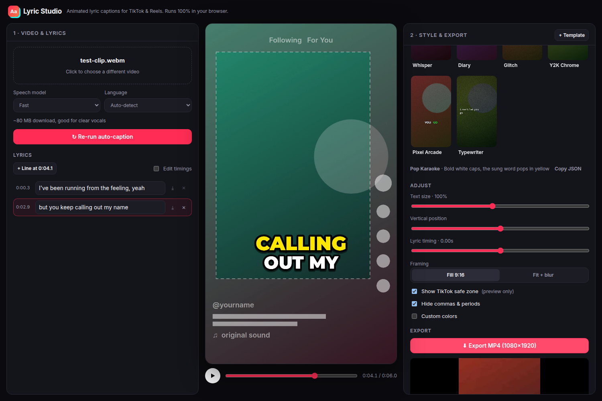
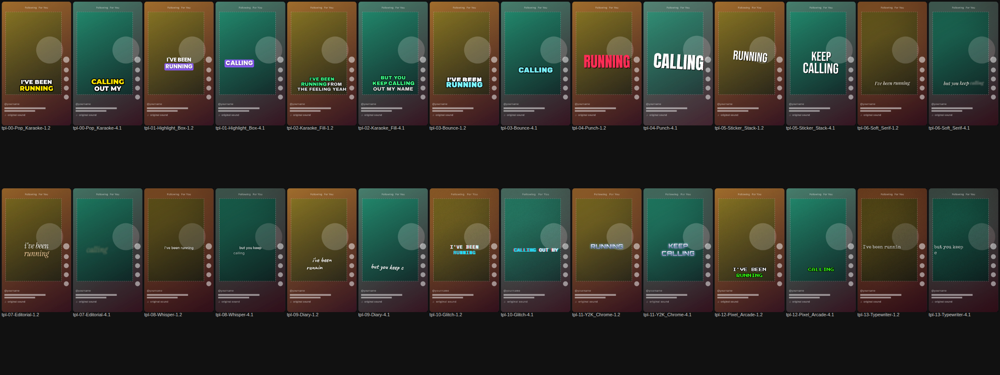

# Lyric Studio



Turn a vertical music clip into a TikTok-ready lyric video: auto-captions from the vocals, animated
TikTok-style text, kept inside TikTok's safe zone, exported as a 1080×1920 MP4.

**Everything runs in the browser.** Speech recognition (Whisper via transformers.js) and video
rendering (WebCodecs via Mediabunny) happen on the user's own machine. Videos are never uploaded,
there's no server to pay for, and it can be hosted for free as a static site.

## Use it

```bash
cd lyric-studio
npm install
npm run dev        # http://localhost:5173 (use desktop Chrome or Edge)
```

1. **Drop a video** (MP4/MOV/WebM, ideally vertical).
2. **Auto-caption.** The first run downloads the speech model (~80 MB for Fast, ~250 MB for Accurate). After that it's cached.
   Pick the language if auto-detect guesses wrong.
   **Or import subtitles** (.srt / .vtt / .lrc) from DaVinci Resolve, Premiere, CapCut or a lyrics site.
   DaVinci's 01:00:00:00 timeline offset is removed automatically. Word-timed files (YouTube VTT, enhanced LRC)
   keep exact word timings; otherwise words are spread inside each subtitle. Tip: in Resolve, keep subtitles
   short (1–3 words) for the tightest timing.
3. **Fix the lyrics.** Edit words in the left panel. Fix sync in the **timeline** under the preview:
   - drag word or line blocks to move them, drag their edges to trim (touching words share an edge)
   - blocks snap to the playhead and other lines (hold <kbd>Alt</kbd> for free movement)
   - <kbd>Ctrl</kbd>+scroll zooms, and 0.5× / 0.75× playback helps you hear exactly where words land
   - **Tap-sync:** press *Tap-sync*, play the song and hold <kbd>T</kbd> while each word is sung
   - keyboard: <kbd>[</kbd> <kbd>]</kbd> set the selected block's start/end to the playhead, <kbd>←</kbd> <kbd>→</kbd> nudge by a frame
     (<kbd>Shift</kbd> = 0.1 s), <kbd>Tab</kbd> selects the next word, <kbd>Ctrl</kbd>+<kbd>Z</kbd> undoes
   - the *Lyric timing* slider shifts everything if all the lyrics are equally early or late
4. **Pick a style** from the gallery (hover a thumbnail to see it animate). Then **Customize** it:
   - **Text:** any font from the list or any Google Font by name, weight, caps, italic
   - **Motion:** words on screen (line / 2–3 words / one word), entrance animation, and movement
     (centered, scatter, zigzag, staircase, orbit, wander, DVD bounce)
   - **Payoff moments** (a word gets its own full moment, like Blackout's black screen): when they happen
     (template default / every line end / only words you pick) and the background (black, white, accent, keep video).
     Pick exact words in the timeline: select a word → **Payoff Auto / On / Off**, or press <kbd>P</kbd>.
   - plus size, position, framing (fill or fit + blurred background) and colors
5. **Export MP4** at the same quality as your clip:
   - **Frame rate:** every original frame is kept at its exact timestamp (29.97, 59.94, 120 fps and variable-rate phone footage are preserved)
   - **Resolution:** matches the clip (4K stays 2160×3840), or pick 1080/1440/2160
   - **Bitrate:** your clip's bitrate by default (constant bitrate, so the number actually matches), or type your own Mbps.
     The export measures what the encoder really produced and runs one corrective pass if it came in >10% low.
   - **Codec:** same as your clip (H.264/HEVC) when the browser can encode it
   - **Audio:** copied bit-for-bit from the clip, no re-encoding
   - HDR clips (iPhone default) come out SDR, because browsers draw video in SDR. The app warns you.

**Saved subtitles (reuse a synced song):** after syncing, click **💾 Save current** and name it (e.g. the song title).
In a future project with the same song, click **Use**. The app compares the audio and finds where the new clip sits
in the song, then moves the lyrics there automatically. If it can't match confidently, it says so and you can
nudge with the *Shift all lyrics* buttons (all changes are undoable). Tick *Also load the style* to bring back the
template and customizations too. The library lives in your browser; use **Export library** to back it up or move it
to another computer, and **Import library** to bring it back.

Captions also autosave in the browser per video. *Save project* / *Load project* move one project between machines,
and *.srt* gives you a plain subtitle file.

## New animation styles



Templates are JSON files in `src/templates/`. See [TEMPLATES.md](TEMPLATES.md).
With Claude Code open in this repo, just ask: *"make a lyric template that feels like a 2000s emo music video"*.
The `lyric-template` skill writes and validates the file. In the hosted app, paste JSON via **+ Template**.

## Deploy (free)

It's a static site: `npm run build` → upload `dist/`. Vercel or Netlify work out of the box
(import the repo, root directory `lyric-studio`, build `npm run build`, output `dist`).
Note: the bundled ONNX runtime `.wasm` is ~27 MB, over Cloudflare Pages' 25 MB per-file limit.

## Limits to know

- **Sung vocals are hard for Whisper.** Clear vocals over a quiet beat work well. Heavy autotune, ad-libs and
  loud mixes cause misheard words, so plan on a quick edit pass. The *Accurate* model helps.
- **Browser:** desktop Chrome/Edge recommended (WebGPU for fast transcription, H.264/AAC export).
  Firefox/Safari may fall back to slower transcription or VP9/Opus output.
- **Export speed** is roughly real-time on a typical laptop. Long clips (> 3 min) use a lot of memory.

## Code map

```
src/lib/render.ts           Caption renderer: grouping, layout inside safe zone, animation, effects
src/lib/anim.ts             Enter/exit animations, easings, deterministic randomness
src/lib/tiktok.ts           1080×1920 frame + TikTok safe zone + preview overlay
src/lib/transcribe*.ts      Whisper in a Web Worker (WebGPU → CPU fallback), word timestamps
src/lib/lyrics.ts           Words → lines, retiming edits, SRT
src/lib/export.ts           Frame-accurate MP4 export (Mediabunny / WebCodecs)
src/templates/*.json        Built-in styles
src/components/             Preview, lyrics editor, template gallery, import dialog
```

Preview and export use the same renderer and deterministic "randomness", so the MP4 matches the preview.
